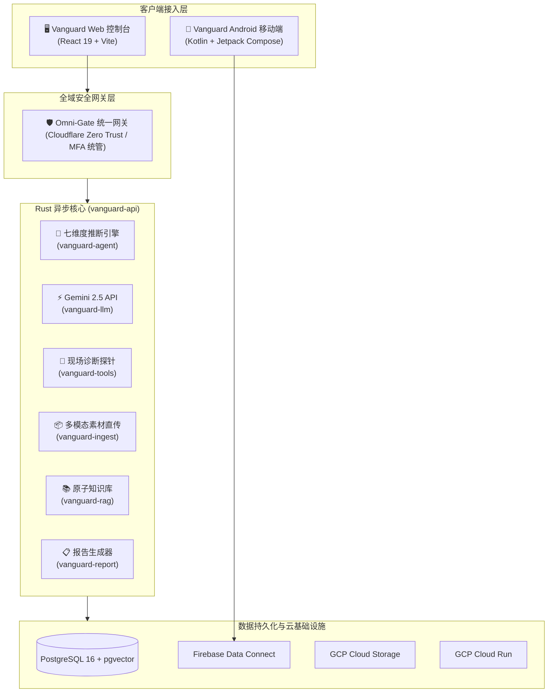

# 🛡️ Vanguard — FBE 客户洞察与全生命周期智能作业平台

**Vanguard** 是专门为前线部署工程师（FBE, Frontier/Forward Deployed Engineer）量身打造的客户洞察、技术勘测、PoC 追踪、现场排障与知识沉淀全流程平台。

通过集成自研多模态 AI Agent（Gemini 2.5 Pro / Flash）与原子化 RAG 知识库，Vanguard 能够协助 FBE 将现场采集的零散素材（音频访谈、机房照片、日志抓包、环境配置）秒级转化为结构化的**七维度需求洞察矩阵**与标准化交付报告。

---

## 🏗️ 架构概览 (Architecture Overview)



- **全自主 Rust 后端**：基于 Axum 框架与 Tokio 异步运行时，拆分为 8 个独立核心 Crates。
- **Web 控制台**：React 19 + TypeScript + Vite，接入全域统一 Omni-Gate 零信任动态代理网关。
- **Android 原生现场采集端**：Kotlin 2.0 + Jetpack Compose Material 3，支持现场波形录音采集与 5 大事务看板。
- **多模态与 LLM 引擎**：Gemini 2.5 Pro / Flash 深度推断与现场诊断探针（`system_ping`, `curl_probe`, `config_patcher`）。
- **原子化 RAG 知识库**：5 大显式分类与混合检索，支持现场洞察一键 Promote 沉淀为团队标准资产。
- **云原生部署**：支持 Docker Compose 本地一键拉起及 GCP Cloud Build / Cloud Run 自动化 CI/CD。

---

## 💼 FBE 全生命周期 5 大事务类型

| 事务类型 | 业务目标 | 核心产出 |
| :--- | :--- | :--- |
| **`INTERVIEW`** | 客户现场访谈与需求挖掘 | 七维度显性/隐性诉求矩阵、JTBD 价值框架 |
| **`INFRA_SURVEY`** | 现场勘测与拓扑审计 | 硬件 Specs、网络隔离与依赖 Gap 诊断清单 |
| **`POC_TRACKING`** | PoC 试点与卡点追踪 | 里程碑达成率评估、技术 Blocker 归因矩阵 |
| **`TROUBLESHOOTING`** | 现场排障与 Post-Mortem | 崩溃日志 RCA 根因定位、探针诊断与补丁 |
| **`SOW_PROPOSAL`** | SOW 实施提案与复盘 | 分阶段交付范围评估、工期测算与增购机会 |

---

## ⚡ 快速启动 (Quick Start)

### 1. 本地一键 Docker 启动
```bash
# 复制环境变量模板
cp .env.example .env

# 一键拉起 PostgreSQL (pgvector) 与 Vanguard 全栈服务
docker compose -f infra/docker-compose.yml up --build
```

### 2. 独立本地调试开发
```bash
# 启动 Web 前端开发服务器
cd vanguard-web
npm install
npm run dev

# 启动 Rust 后端服务
cd ..
./scripts/dev.sh
```
服务默认监听 `http://localhost:8080`。

---

## 🛠️ 项目结构 (Workspace Structure)

```text
Vanguard/
├── Cargo.toml                  # Rust Workspace 根配置
├── .env.example                # 环境变量配置模板
├── crates/
│   ├── vanguard-api/           # Axum HTTP/WebSocket/SSE 路由服务
│   ├── vanguard-auth/          # Google IAP / Firebase Auth / 2FA 零信任鉴权
│   ├── vanguard-ingest/        # 多模态素材 (音频/图片/日志) 预签名解析
│   ├── vanguard-agent/         # 七维度需求挖掘与推断 Agent 引擎
│   ├── vanguard-tools/         # 现场探针 (Ping/Curl/ConfigPatcher) 工具箱
│   ├── vanguard-llm/           # 自研 Gemini 2.5 API HTTP 客户端
│   ├── vanguard-rag/           # 原子化知识库与混合检索引擎
│   └── vanguard-report/        # 七维度 Markdown / HTML 报告生成器
├── vanguard-web/               # React 19 + TypeScript + Vite Web 控制台
├── vanguard-android/           # Kotlin + Jetpack Compose Android 移动端
├── dataconnect/                # Firebase Data Connect (GraphQL Schema & SDK)
├── docs/                       # 业务 PRD、事务规范、架构设计与开发进度文档
├── infra/                      # Dockerfile / docker-compose.yml / cloudbuild.yaml / SQL
└── scripts/                    # 开发启动 (dev.sh) 与部署脚本 (deploy_ailab.sh)
```

---

## 📖 核心文档导航

### 💼 业务规范
- [01. 产品需求文档 (PRD)](docs/business/01_product_requirements.md)
- [02. FBE 全生命周期事务扩展规范](docs/business/02_engagement_workflows.md)
- [03. Agent 知识库规范](docs/business/03_knowledge_base_spec.md)
- [04. Web UI 使用手册](docs/business/04_web_ui_manual.md)

### 🛠️ 技术设计
- [01. 全栈系统架构设计](docs/technical/01_architecture.md)
- [02. 数据模型与 SQL Schema](docs/technical/02_data_model.md)
- [03. REST API 与 WebSocket 设计](docs/technical/03_api_design.md)
- [04. Token 预算与用量控制](docs/technical/04_token_budget.md)
- [05. GCP AI Lab 部署指南](docs/technical/05_deployment_ailab.md)

### 🔨 开发进度
- [02. 最新开发进度追踪与里程碑](docs/development/02_progress.md)
