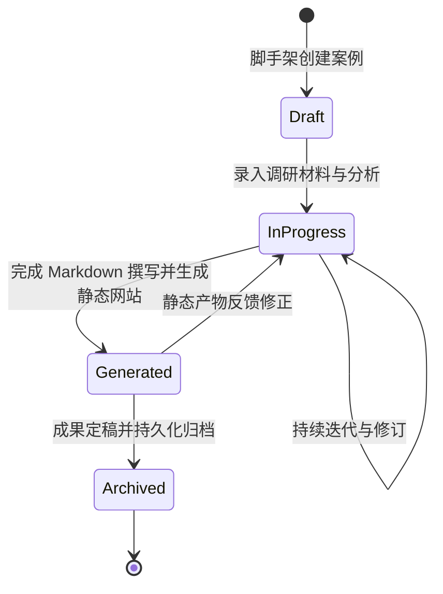

# 案例数据模型与生命周期规范

## 1. 案例目录架构标准

每个案例在 `cases/` 目录下作为一个独立单元进行管理，命名必须遵循标准规范（小写短横线命名法，如 `cases/2026-q4-market-analysis/`）。

标准案例目录结构如下：

```text
cases/{case_id}/
├── metadata.json           # 案例核心元数据（机读与自动化索引依据）
├── docs/                   # 案例文档与原始分析材料
│   ├── 01_overview.md      # 案例背景与核心目标
│   ├── 02_research.md      # 调研数据、对比与分析过程
│   └── 03_conclusion.md    # 核心结论、推演与决策建议
└── site/                   # 案例静态网站交付产物 (开箱即用)
    ├── index.html          # 静态展示页面主入口
    ├── css/
    │   └── main.css        # 样式文件 (符合现代 UI 规范)
    ├── js/
    │   └── app.js          # 原生轻量交互脚本
    └── assets/             # 图片、SVG 图表或静态数据 JSON
```

---

## 2. 案例元数据规范 (`metadata.json`)

为了便于本地 PowerShell 脚本自动化归档、全局索引检索与静态网站生成，每个案例根目录下必须包含合规的 `metadata.json`：

```json
{
  "$schema": "../../docs/templates/case_metadata_schema.json",
  "id": "case-2026-sample",
  "title": "案例全中文标准标题",
  "category": "市场调研 | 技术评测 | 运营策略 | 投资分析",
  "status": "draft | in_progress | generated | archived",
  "author": "负责人姓名或代号",
  "created_at": "2026-10-03",
  "updated_at": "2026-10-03",
  "summary": "一段用于展示在平台全局索引与静态网站导语中的简要概述（100-200字以内）。",
  "tags": ["AI", "本地化", "架构重构"],
  "deliverables": {
    "site_entry": "site/index.html",
    "docs_entry": "docs/01_overview.md"
  }
}
```

### 字段说明与约束：
- **`id`** (字符串, 必填)：唯一标识符，全小写字母、数字与中划线组合。
- **`title`** (字符串, 必填)：面向人类阅读的正式中文标题。
- **`category`** (枚举, 必填)：案例所属主分类。
- **`status`** (枚举, 必填)：当前生命周期状态。
- **`summary`** (字符串, 必填)：核心摘要，用于静态卡片预览。
- **`tags`** (字符串数组, 必填)：用于跨案例检索和分类筛选。
- **`deliverables`** (对象, 必填)：标明该案例的主要输出文件相对路径。

---

## 3. 案例生命周期与流转状态机



### 3.1 各阶段定义与准出条件

| 阶段 | 状态码 | 核心任务 | 准出条件 (Exit Criteria) |
| :--- | :--- | :--- | :--- |
| **草稿立项** | `draft` | 案例立项、目录初始化、核心问题定义 | 本地创建 `metadata.json`，完成 `docs/01_overview.md` 的背景定义。 |
| **详细设计推进** | `in_progress` | 业务SOP梳理、系统功能规划与样板开发 | 1. 建立案件同名公开仓库 `Vanguard-<CaseName>` (Public)；<br>2. 结构化设计文档完整归档至案例仓库 `docs/`；<br>3. 完成高保真**设计展示样板网页** (`site/index.html`)；<br>4. 配置 GitHub Actions 自动部署工作流与独立域名文件 (`site/CNAME`)。 |
| **产物生成定稿** | `generated` | 样板网页多端核验通过，完成线上部署发布 | 案件仓库主分支推送后，GitHub Actions 自动化部署至 GitHub Pages 成功，线上独立域名正常访问，本地双击（`file:///`）0 报错。 |
| **归档持久** | `archived` | 案例关闭、索引更新、永久归档 | 元数据状态置为 `archived`，更新全局案例索引表。 |

---

## 4. 案例文档编写规范 (Docs Guidelines)

1. **结构统一**：必须包含“背景/痛点”、“分析推导”、“核心结论与决策建议”三要素。
2. **数据与逻辑具象化**：优先使用 Markdown 表格、引用块（Alerts）以及可转换为图表的结构化文本。
3. **内容提炼度**：在将案例文档转化为静态网站产物前，应在结论篇专门梳理出“核心看板数据”、“关键发现列表”与“交互式演示模块要点”，以便静态网站直接对准呈现。
